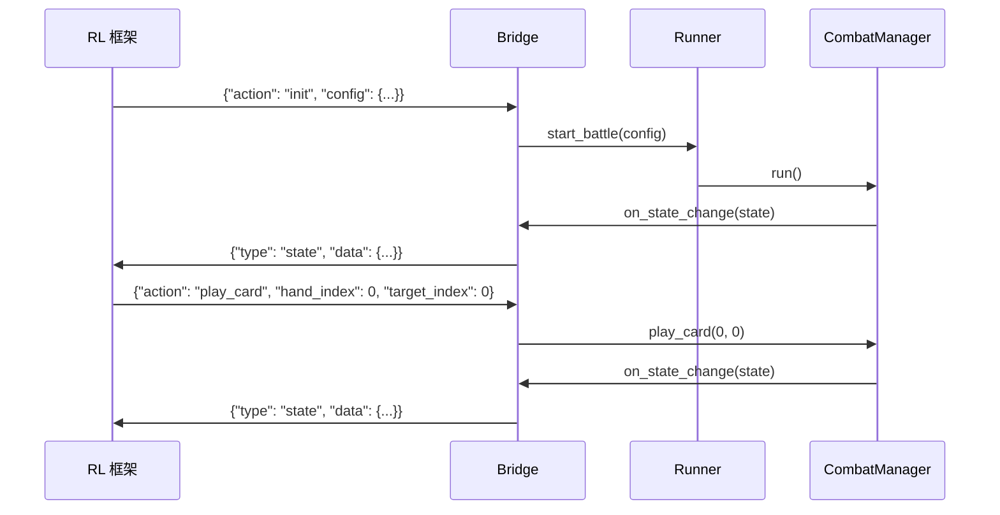
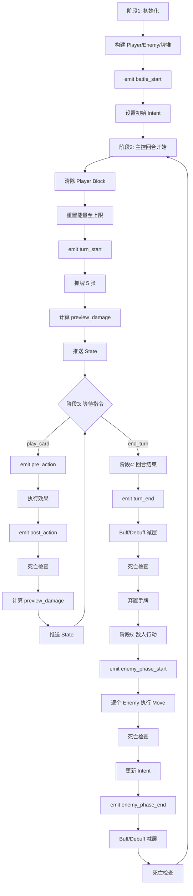

# STS2 战斗模拟器 — 技术设计文档

## 概述

本文档描述《杀戮尖塔2》战斗模拟器（sts2-battle-simulator）的技术设计，该模拟器专为强化学习 AI 训练设计。系统仅覆盖战斗模块，实现核心战斗逻辑与静态资源数据（卡牌、遗物、敌人、药水）。

系统由两个核心子模块组成：
- **CombatManager**（原 Simulator Core）：执行单场战斗的主循环
- **Bridge**：通信中间层，将战斗状态序列化并通过 ZeroMQ 推送给外部消费方（如 RL 框架），同时接收外部指令转发给 CombatManager

RL 框架不在本项目范围内，本项目只负责实现 CombatManager、Runner 和 Bridge。

## 架构

### 整体拓扑

```
外部消费方（RL 框架）
        ↕ ZeroMQ ipc:// REQ-REP
      Bridge（zmq_bridge.py）
        ↕ 进程内函数调用 / 回调
      Runner（SingleBattleRunner / CampaignRunner）
        ↕ 创建 / 控制
      CombatManager（单场战斗主循环）
        ↕ 读写
      BattleContext（战斗状态容器）
        ↕ 事件
      EventBus → EffectResolver / BuffManager
        ↕ 查询
      Registry（统一资源注册表）
```

### 通信流程



### 项目结构

```
sts2_simulator/
├── combat/
│   ├── manager.py       # CombatManager：单场战斗主循环
│   ├── context.py       # BattleContext
│   ├── player.py        # Player 状态
│   ├── enemy.py         # Enemy 实例状态
│   └── card_pile.py     # 手牌/牌堆管理
├── engine/
│   ├── effect_resolver.py  # 数据驱动效果解析
│   ├── event_bus.py        # 可中断事件链
│   └── buff_manager.py     # Buff/Debuff 管理
├── data/
│   ├── registry.py      # 统一资源注册表
│   ├── cards.py         # 内置卡牌静态数据
│   ├── relics.py        # 内置遗物静态数据
│   ├── enemies.py       # 内置敌人静态数据
│   ├── potions.py       # 内置药水静态数据
│   └── buffs.py         # 内置 Buff/Debuff 定义
├── runner/
│   ├── single.py        # SingleBattleRunner
│   ├── campaign.py      # CampaignRunner
│   └── config.py        # Runner 配置数据模型
└── bridge/
    └── zmq_bridge.py    # ZeroMQ REP socket
```

## 组件与接口

### CombatManager

`CombatManager` 是单场战斗的主控制器，负责驱动战斗主循环、协调各子系统。

```python
class CombatManager:
    def __init__(self, config: dict, registry: Registry, on_state_change: Callable[[dict], None]):
        ...

    def run(self) -> None:
        """启动战斗主循环（阻塞直到战斗结束）"""

    def play_card(self, hand_index: int, target_index: int) -> dict:
        """打出手牌，返回 {"ok": True} 或 {"error": "..."}"""

    def use_potion(self, slot_index: int, target_index: int) -> dict:
        """使用药水，返回 {"ok": True} 或 {"error": "..."}"""

    def end_turn(self) -> dict:
        """结束玩家回合"""

    def get_state(self) -> dict:
        """返回当前战斗状态快照"""

    def get_legal_actions(self) -> list[dict]:
        """返回当前合法动作列表"""
```

### EventBus

可中断事件链，支持优先级排序。优先级约定：遗物=10，Buff/Debuff=5，卡牌效果=0。

```python
STOP_PROPAGATION = object()

class EventBus:
    def __init__(self):
        self._handlers: dict[str, list[tuple[int, Callable]]] = {}

    def on(self, event: str, handler: Callable, priority: int = 0):
        """注册事件处理器，按优先级降序排列"""
        self._handlers.setdefault(event, []).append((priority, handler))
        self._handlers[event].sort(key=lambda x: -x[0])

    def emit(self, event: str, ctx: BattleContext, **kwargs) -> bool:
        """触发事件，返回 False 表示被中断"""
        for _, handler in self._handlers.get(event, []):
            result = handler(ctx, **kwargs)
            if result is STOP_PROPAGATION:
                return False
        return True
```

支持的事件列表：

| 事件名 | 触发时机 |
|--------|----------|
| `battle_start` | 战斗初始化完成后 |
| `turn_start` | 玩家回合开始 |
| `turn_end` | 玩家回合结束 |
| `pre_action` | 每次出牌/药水前 |
| `post_action` | 每次出牌/药水后 |
| `pre_damage` | 每次单次伤害结算前（连击每 hit 各触发一次） |
| `post_damage` | 每次单次伤害结算后 |
| `on_card_played` | 卡牌打出时 |
| `on_damage_taken` | 单位受到伤害时 |
| `on_block_gained` | 单位获得 Block 时 |
| `on_buff_applied` | Buff/Debuff 被施加时 |
| `enemy_phase_start` | 敌人行动阶段开始 |
| `enemy_phase_end` | 敌人行动阶段结束 |
| `battle_end` | 战斗结束（胜利或失败） |

### EffectResolver

数据驱动效果解析器，将 `effects: list[dict]` 转化为实际战斗操作。

```python
class EffectResolver:
    def resolve(self, effect: dict, ctx: BattleContext, source, target):
        match effect["type"]:
            case "deal_damage":       # 单体伤害
            case "deal_damage_all":   # AOE，对所有存活敌人
            case "deal_damage_multi": # 连击，每 hit 独立触发 pre/post_damage
            case "gain_block":        # 获得格挡
            case "draw_cards":        # 抓牌
            case "apply_buff":        # 施加 Buff/Debuff
            case "gain_energy":       # 获得能量
```

连击伤害处理流程（每次 hit 独立）：
```
emit(pre_damage) → 计算最终伤害 → Block 抵消 → 扣 HP → emit(post_damage) → 死亡检查
```

### BuffManager

管理所有单位的 Buff/Debuff 状态，在回合结束时执行减层逻辑。

```python
class BuffManager:
    def apply(self, target, buff_id: str, stacks: int, ctx: BattleContext):
        """叠加 Buff/Debuff，触发 on_buff_applied 事件"""

    def tick(self, target, ctx: BattleContext):
        """减层处理，归零则移除；中毒等产生 HP 变化时触发死亡检查"""

    def tick_all(self, ctx: BattleContext):
        """对所有单位执行 tick"""
```

### Registry

统一资源注册表，内置静态资源与运行时注册资源共用同一存储。

```python
class Registry:
    def register_card(self, defn: CardDef): ...
    def register_relic(self, defn: RelicDef): ...
    def register_enemy(self, defn: EnemyDef): ...
    def register_potion(self, defn: PotionDef): ...
    def register_buff(self, defn: BuffDef): ...

    def get_card(self, id: str) -> CardDef:      # 不存在则 raise KeyError
    def get_relic(self, id: str) -> RelicDef:
    def get_enemy(self, id: str) -> EnemyDef:
    def get_potion(self, id: str) -> PotionDef:
    def get_buff(self, id: str) -> BuffDef:

    def load_from_json(self, path: str): ...
    def load_from_dict(self, data: dict): ...
```

### Runner

```python
class SingleBattleRunner:
    def __init__(self, config: SingleBattleConfig, bridge: ZmqBridge): ...
    def run(self): ...
    @classmethod
    def from_json(cls, path: str, bridge: ZmqBridge) -> "SingleBattleRunner": ...

class CampaignRunner:
    def __init__(self, config: CampaignConfig, bridge: ZmqBridge): ...
    def run(self): ...
    @classmethod
    def from_json(cls, path: str, bridge: ZmqBridge) -> "CampaignRunner": ...
```

### ZmqBridge

```python
class ZmqBridge:
    def __init__(self, address: str = "ipc:///tmp/sts2_sim.ipc"): ...

    def on_state_change(self, state: dict) -> None:
        """CombatManager 回调，序列化并推送 state，等待 action 回复"""

    def on_battle_end(self, log: dict) -> None:
        """Runner 在每场战斗结束后调用，推送 battle_log"""

    def on_campaign_end(self, log: dict) -> None:
        """CampaignRunner 结束后调用，推送 campaign_log"""
```

## 数据模型

### Player

```python
@dataclass
class Player:
    hp: int
    max_hp: int
    energy: int
    max_energy: int
    block: int
    buffs: dict[str, int]                        # {"strength": 3, "vulnerable": 2}
    hand: list[CardInstance]
    draw_pile: list[CardInstance]
    discard_pile: list[CardInstance]
    exhaust_pile: list[CardInstance]
    relics: list[RelicInstance]
    potions: list[PotionInstance | None]          # 固定槽位，None 表示空
```

### Enemy

```python
@dataclass
class Enemy:
    id: str
    hp: int
    max_hp: int
    block: int
    buffs: dict[str, int]
    is_dead: bool
    move_index: int                               # sequential_loop 当前位置
    intents: list[IntentType]                     # 当前回合意图列表（可多个）
```

### IntentType 枚举

```python
class IntentType(Enum):
    ATTACK = "attack"
    DEFEND = "defend"
    BUFF = "buff"
    DEBUFF = "debuff"
    SUMMON = "summon"
    SUICIDE = "suicide"
```

### Intent（单个意图）

```python
@dataclass
class Intent:
    type: IntentType
    value: int | None    # 攻击伤害值、格挡值等
    target: str | None   # "player" 或 enemy id
```

### CardDef（静态定义）

```python
@dataclass
class CardDef:
    id: str
    name: str
    cost: int
    card_type: str                    # "attack" | "skill" | "power"
    target: str                       # "single" | "all" | "self" | "none"
    exhaust: bool = False             # 使用后消耗而非进弃牌堆
    playable: bool = True             # False=无法主动打出（诅咒/状态牌）
    effects: list[dict]               # 数据驱动效果列表
    effect_fn: Callable | None = None # 复杂效果注入函数（优先于 effects）
```

### CardInstance（战斗中实例）

```python
@dataclass
class CardInstance:
    defn: CardDef
    preview_damage: dict[int, list[int]] | None = None
    # key=目标 enemy 索引，value=每次 hit 的伤害列表（连击为多个值）
    # 非攻击牌为 None
```

### BuffDef（静态定义）

```python
@dataclass
class BuffDef:
    id: str
    name: str
    is_permanent: bool = False        # True=永久，不减层
    reduce_on: str = "turn_end"       # "turn_start" | "turn_end"
    # 效果通过 EventBus hook 实现，不在此定义
```

### RelicDef

```python
@dataclass
class RelicDef:
    id: str
    name: str
    trigger: str                      # "turn_start" | "on_damage_taken" | "on_card_played" | ...
    effects: list[dict]               # 数据驱动
    effect_fn: Callable | None = None
```

### PotionDef

```python
@dataclass
class PotionDef:
    id: str
    name: str
    target: str                       # "single" | "self" | "none"
    effects: list[dict]
    effect_fn: Callable | None = None
```

### EnemyDef

```python
@dataclass
class MoveDef:
    name: str
    intents: list[Intent]             # 该 Move 对应的意图列表
    effects: list[dict]
    effect_fn: Callable | None = None

@dataclass
class EnemyDef:
    id: str
    name: str
    hp: int
    max_hp: int
    moves: dict[str, MoveDef]
    move_pattern: str                 # "sequential_loop" | "fn"
    move_fn: Callable | None = None   # fn 模式：(enemy, ctx, turn) -> str
    move_order: list[str]             # sequential_loop 时的顺序
```

### BattleContext

```python
@dataclass
class BattleContext:
    player: Player
    enemies: list[Enemy]
    turn: int
    phase: str                                    # "init" | "player_turn" | "player_action" | "enemy_turn" | "ended"
    event_bus: EventBus
    registry: Registry
    log: list[dict]                               # 实时追加的战斗日志
    on_state_change: Callable[[dict], None]       # Bridge 注册的回调
```

### Runner 配置模型

```python
@dataclass
class EnemyConfig:
    id: str
    hp: int
    max_hp: int

@dataclass
class SingleBattleConfig:
    player_hp: int
    player_max_hp: int
    player_energy: int = 3
    deck: list[str] = field(default_factory=list)
    relics: list[str] = field(default_factory=list)
    potions: list[str] = field(default_factory=list)
    enemies: list[EnemyConfig] = field(default_factory=list)
    num_battles: int = 1

@dataclass
class CampaignConfig:
    initial_player_hp: int
    initial_player_max_hp: int
    initial_energy: int = 3
    initial_deck: list[str] = field(default_factory=list)
    initial_relics: list[str] = field(default_factory=list)
    initial_potions: list[str] = field(default_factory=list)
    enemy_sequence: list[list[EnemyConfig]] = field(default_factory=list)
    max_battles: int = 100
```

## 战斗主循环（CombatManager）

### 流程图



### 阶段详述

**阶段1：初始化**
1. 从 Registry 查询所有卡牌/遗物/敌人/药水定义，构建实例
2. 将牌组洗入 draw_pile
3. 为每个遗物在 EventBus 注册对应事件处理器（优先级=10）
4. `emit(battle_start)`
5. 为每个 Enemy 计算初始 Intent（move_order[0] 的 intents）

**阶段2：主控回合开始**
1. `player.block = 0`
2. `player.energy = player.max_energy`
3. `emit(turn_start)`（遗物如 Akabeko 在此触发）
4. 执行[抓牌流程(5张)]
5. 重新计算所有手牌的 `preview_damage`
6. 调用 `on_state_change(get_state())`

**阶段3：主控行动（循环等待指令）**
- 收到 `play_card(hand_index, target_index)`：
  1. 验证：手牌索引合法、卡牌 playable=True、能量足够、目标合法
  2. `emit(pre_action)`
  3. 扣除能量，执行效果（调用 EffectResolver）
  4. 将卡牌移入 discard_pile（exhaust=True 则移入 exhaust_pile）
  5. `emit(post_action)` / `emit(on_card_played)`
  6. 死亡检查 → 若战斗结束则退出循环
  7. 重新计算 `preview_damage`，推送 State
- 收到 `use_potion(slot_index, target_index)`：类似流程，使用后将槽位置 None
- 收到 `end_turn`：退出循环，进入阶段4

**阶段4：主控回合结束**
1. `emit(turn_end)`
2. `buff_manager.tick_all(ctx)`（减层，中毒等触发死亡检查）
3. 将 hand 中所有牌移入 discard_pile

**阶段5：敌人行动**
1. `emit(enemy_phase_start)`
2. 遍历 enemies（跳过 is_dead=True）：
   - 根据 move_pattern 确定本回合 Move（sequential_loop 或 fn）
   - 执行 Move 的 effects（调用 EffectResolver）
   - 死亡检查（Player HP≤0 则触发战斗失败）
   - 更新 move_index，计算下一回合 Intent
3. `emit(enemy_phase_end)`
4. `buff_manager.tick_all(ctx)`
5. 死亡检查

### 死亡检查子流程

```python
def death_check(target, ctx: BattleContext) -> bool:
    """返回 True 表示战斗已结束"""
    if isinstance(target, Enemy) and target.hp <= 0:
        target.is_dead = True
        if all(e.is_dead for e in ctx.enemies):
            ctx.phase = "ended"
            ctx.log.append({"event": "victory"})
            emit(battle_end, result="victory")
            return True
    elif isinstance(target, Player) and target.hp <= 0:
        ctx.phase = "ended"
        ctx.log.append({"event": "defeat"})
        emit(battle_end, result="defeat")
        return True
    return False
```

### 伤害结算子流程

```python
def resolve_damage(source, target, base_value: int, ctx: BattleContext) -> bool:
    """返回 True 表示战斗已结束"""
    emit(pre_damage, source=source, target=target, value=base_value)
    # 应用力量加成（攻击方）
    value = base_value + source.buffs.get("strength", 0)
    # 应用虚弱减伤（攻击方）
    if source.buffs.get("weak", 0) > 0:
        value = floor(value * 0.75)
    # 应用脆弱加伤（防御方）
    if target.buffs.get("vulnerable", 0) > 0:
        value = floor(value * 1.5)
    # Block 先抵消
    absorbed = min(target.block, value)
    target.block -= absorbed
    target.hp -= (value - absorbed)
    emit(post_damage, source=source, target=target, actual=value - absorbed)
    return death_check(target, ctx)
```

### 伤害预览计算

每次状态变化后，对手牌中所有攻击牌重新计算 `preview_damage`：

```python
def compute_preview(card: CardDef, ctx: BattleContext) -> dict[int, list[int]] | None:
    """
    对每个存活敌人计算实际伤害（含力量/虚弱/脆弱修正）。
    连击牌返回多个值的列表，非攻击牌返回 None。
    """
    if card.card_type != "attack":
        return None
    result = {}
    for i, enemy in enumerate(ctx.enemies):
        if enemy.is_dead:
            continue
        hits = []
        for effect in card.effects:
            if effect["type"] in ("deal_damage", "deal_damage_multi"):
                count = effect.get("count", 1)
                base = effect["value"] + ctx.player.buffs.get("strength", 0)
                if ctx.player.buffs.get("weak", 0) > 0:
                    base = floor(base * 0.75)
                if enemy.buffs.get("vulnerable", 0) > 0:
                    base = floor(base * 1.5)
                hits.extend([base] * count)
        result[i] = hits
    return result
```

## Bridge 通信协议

### ZeroMQ 配置

- 模式：REQ-REP（外部消费方为 REQ，Bridge 为 REP）
- 协议：`ipc://`（Unix Socket，同机器高速通信）
- 默认地址：`ipc:///tmp/sts2_sim.ipc`

### Bridge 推送的消息类型

```json
{"type": "state",        "data": {...}}
{"type": "battle_log",   "data": {...}}
{"type": "campaign_log", "data": {...}}
```

### State JSON 结构

```json
{
  "type": "state",
  "data": {
    "turn": 3,
    "phase": "player_action",
    "player": {
      "hp": 54,
      "max_hp": 80,
      "energy": 2,
      "max_energy": 3,
      "block": 12,
      "buffs": {"strength": 2},
      "hand": [
        {
          "index": 0,
          "card_id": "strike",
          "cost": 1,
          "playable": true,
          "exhaust": false,
          "preview_damage": {"0": [9], "1": [9]}
        }
      ],
      "draw_pile_count": 5,
      "discard_pile_count": 3,
      "potions": [
        {"slot": 0, "id": "block_potion"},
        null
      ]
    },
    "enemies": [
      {
        "index": 0,
        "id": "jaw_worm",
        "hp": 20,
        "max_hp": 44,
        "block": 0,
        "buffs": {},
        "is_dead": false,
        "intents": [{"type": "attack", "value": 11}]
      }
    ],
    "legal_actions": [
      {"action": "play_card", "hand_index": 0, "target_index": 0},
      {"action": "end_turn"}
    ],
    "result": null
  }
}
```

`result` 字段：`null`（进行中）、`"victory"`、`"defeat"`。

### Action JSON 协议

```json
// 初始化
{
  "action": "init",
  "config": {
    "player": {"hp": 54, "max_hp": 80, "energy": 3},
    "deck": ["strike", "strike", "defend"],
    "relics": ["akabeko"],
    "potions": ["block_potion"],
    "enemies": [{"id": "jaw_worm", "hp": 40, "max_hp": 40}]
  }
}

// 出牌
{"action": "play_card", "hand_index": 0, "target_index": 0}

// 使用药水
{"action": "use_potion", "slot_index": 0, "target_index": 0}

// 结束回合
{"action": "end_turn"}
```

### 错误响应格式

```json
{"ok": false, "error": "insufficient_energy"}
{"ok": false, "error": "invalid_target: enemy_dead"}
{"ok": false, "error": "battle_already_ended"}
{"ok": false, "error": "unknown_card_id: xxx"}
```

### Log 结构

**Battle Log（单场）**

```json
{
  "battle_id": "uuid",
  "mode": "single",
  "config": {"...": "..."},
  "turns": [
    {
      "turn": 1,
      "actions": [{"action": "play_card", "hand_index": 0, "target_index": 0}],
      "events": [{"event": "damage", "source": "player", "target": 0, "value": 9}]
    }
  ],
  "result": "victory",
  "total_turns": 5
}
```

**Campaign Log**

```json
{
  "campaign_id": "uuid",
  "battles": ["...battle_log..."],
  "final_hp": 12,
  "total_turns": 47,
  "result": "defeat",
  "defeat_reason": "player_hp_zero"
}
```

Log 通过 Bridge 推给外部消费方，外部决定持久化方式。

## 静态资源数据

### 内置卡牌（≥15 张，覆盖全部 7 种机制）

| ID | 名称 | 费用 | 类型 | 机制 | 效果 |
|----|------|------|------|------|------|
| `strike` | 打击 | 1 | attack | 单体伤害 | 造成 6 点伤害 |
| `heavy_blade` | 重刃 | 2 | attack | 高费牌 | 造成 14 点伤害 |
| `twin_strike` | 双重打击 | 1 | attack | 连击 | 造成 2×5 点伤害 |
| `pommel_strike` | 剑柄打击 | 1 | attack | 单体+抓牌 | 造成 9 点伤害，抓 1 张 |
| `whirlwind` | 旋风斩 | X | attack | AOE | 对所有敌人造成 5×X 点伤害 |
| `cleave` | 横扫 | 1 | attack | AOE | 对所有敌人造成 8 点伤害 |
| `defend` | 防御 | 1 | skill | 防御 | 获得 5 点 Block |
| `iron_wave` | 铁波 | 1 | skill | 防御+攻击 | 获得 5 点 Block，造成 5 点伤害 |
| `shrug_it_off` | 一笑置之 | 1 | skill | 防御+抓牌 | 获得 8 点 Block，抓 1 张 |
| `battle_trance` | 战斗恍惚 | 0 | skill | 抓牌 | 抓 3 张牌 |
| `flex` | 弯曲 | 0 | skill | Buff | 获得 2 层力量，回合结束时失去 2 层力量 |
| `inflame` | 燃烧 | 1 | power | Buff | 永久获得 2 层力量 |
| `clothesline` | 晾衣绳 | 2 | attack | 高费+Debuff | 造成 12 点伤害，施加 2 层虚弱 |
| `bash` | 猛击 | 2 | attack | 高费+Debuff | 造成 8 点伤害，施加 2 层脆弱 |
| `thunderclap` | 雷击 | 1 | attack | AOE+Debuff | 对所有敌人造成 4 点伤害并施加 1 层脆弱 |
| `anger` | 愤怒 | 0 | attack | 单体 | 造成 6 点伤害，将自身副本加入弃牌堆 |

### 内置遗物（≥5 个，覆盖多种触发时机）

| ID | 名称 | 触发时机 | 效果 |
|----|------|----------|------|
| `akabeko` | 赤牛 | `turn_start`（首回合） | 第一次打出攻击牌额外造成 8 点伤害 |
| `bag_of_preparation` | 准备袋 | `battle_start` | 战斗开始时额外抓 2 张牌 |
| `bronze_scales` | 铜鳞 | `on_damage_taken` | 受到攻击伤害时对攻击者反弹 3 点伤害 |
| `pen_nib` | 笔尖 | `on_card_played` | 每打出第 10 张牌，下一次攻击伤害翻倍 |
| `odd_mushroom` | 奇异蘑菇 | `on_buff_applied` | 受到虚弱时层数减半（向上取整） |

### 内置敌人（≥3 种，sequential_loop 模式）

**颚虫（Jaw Worm）**

| Move | 意图 | 效果 |
|------|------|------|
| `chomp` | ATTACK 11 | 造成 11 点伤害 |
| `thrash` | ATTACK 7 + DEFEND | 造成 7 点伤害，获得 5 点 Block |
| `bellow` | BUFF + DEFEND | 获得 3 层力量，获得 6 点 Block |

循环顺序：`chomp → thrash → bellow → thrash → bellow → ...`（首回合固定 chomp）

**酸性史莱姆（Acid Slime M）**

| Move | 意图 | 效果 |
|------|------|------|
| `corrosive_spit` | ATTACK 7 + DEBUFF | 造成 7 点伤害，施加 2 层脆弱 |
| `tackle` | ATTACK 10 | 造成 10 点伤害 |
| `lick` | DEBUFF | 施加 1 层虚弱 |

循环顺序：`corrosive_spit → tackle → lick → corrosive_spit → ...`

**哨兵（Sentinel）**

| Move | 意图 | 效果 |
|------|------|------|
| `strike` | ATTACK 9 | 造成 9 点伤害 |
| `tackle` | ATTACK 15 | 造成 15 点伤害 |
| `escape` | BUFF | 获得 5 层力量 |

循环顺序：`strike → tackle → escape → strike → ...`

### 内置药水（4 种）

| ID | 名称 | 目标 | 效果 |
|----|------|------|------|
| `block_potion` | 护甲药水 | self | 获得 12 点 Block |
| `attack_potion` | 攻击药水 | single | 对目标造成 10 点伤害 |
| `card_draw_potion` | 抓牌药水 | none | 抓 3 张牌 |
| `energy_potion` | 能量药水 | none | 获得 2 点能量 |

### 内置 Buff/Debuff

| ID | 名称 | 永久 | 减层时机 | 效果实现 |
|----|------|------|----------|----------|
| `strength` | 力量 | 否 | turn_end | 每次攻击 +N 伤害（EventBus pre_damage） |
| `dexterity` | 敏捷 | 否 | turn_end | 每次获得 Block +N（EventBus on_block_gained） |
| `vulnerable` | 脆弱 | 否 | turn_start | 受到攻击伤害 ×1.5（EventBus pre_damage） |
| `weak` | 虚弱 | 否 | turn_start | 打出攻击牌伤害 ×0.75（EventBus pre_damage） |
| `ritual` | 仪式 | 否 | turn_end | 每回合结束获得 N 层力量（EventBus turn_end） |

## 正确性属性

*属性（Property）是在系统所有合法执行路径上都应成立的特征或行为——本质上是对系统应做什么的形式化陈述。属性是人类可读规范与机器可验证正确性保证之间的桥梁。*

---

### 属性 1：初始化后 State 完整性

*对任意*合法战斗配置（玩家牌组、遗物、敌人组合），初始化后返回的 State 应包含 `player`、`enemies`、`turn=1`、`phase`、`legal_actions` 字段，且 `result` 为 null。

**验证：需求 1.1、1.2**

---

### 属性 2：非法资源 ID 拒绝初始化

*对任意*包含不存在卡牌 ID 或遗物 ID 的初始化配置，系统应返回错误响应并拒绝创建 Battle 实例。

**验证：需求 1.3**

---

### 属性 3：Block 先于 HP 被消耗

*对任意*目标单位（Player 或 Enemy）、任意伤害值和 Block 值，伤害结算后目标的 HP 减少量应等于 `max(0, damage - block_before)`，且 Block 减少量应等于 `min(block_before, damage)`。

**验证：需求 3.6**

---

### 属性 4：伤害结算后 HP 不超过上限

*对任意*伤害结算操作，目标 HP 不应超过其 max_hp，也不应低于 0（死亡检查在 HP 降至 0 时触发）。

**验证：需求 3.6、4.x**

---

### 属性 5：脆弱状态伤害计算

*对任意*处于脆弱（Vulnerable）状态的目标和任意基础伤害值 `base`，实际受到的伤害应等于 `floor(base * 1.5)`。

**验证：需求 4.6**

---

### 属性 6：虚弱状态伤害计算

*对任意*处于虚弱（Weak）状态的攻击方和任意基础伤害值 `base`，实际造成的伤害应等于 `floor(base * 0.75)`。

**验证：需求 4.7**

---

### 属性 7：力量加成伤害计算

*对任意*拥有力量（Strength）状态的攻击方（层数为 N）和任意基础伤害值 `base`，每次 hit 的伤害应等于 `base + N`（在虚弱/脆弱修正之前叠加）。

**验证：需求 4.4**

---

### 属性 8：敏捷加成 Block 计算

*对任意*拥有敏捷（Dexterity）状态的单位（层数为 N）和任意基础 Block 值 `base`，实际获得的 Block 应等于 `base + N`。

**验证：需求 4.5**

---

### 属性 9：exhaust 牌进入 exhaust_pile

*对任意* `exhaust=True` 的卡牌，打出后该卡牌应出现在 `exhaust_pile` 中，而不出现在 `discard_pile` 中。

**验证：需求 3.2（隐含）、设计决策**

---

### 属性 10：不可打出的牌不出现在合法动作中

*对任意*游戏状态，`legal_actions` 中所有打牌动作对应的卡牌，其 `playable` 字段均应为 True，且玩家能量应足够支付其费用。

**验证：需求 8.1、8.3**

---

### 属性 11：合法动作可执行性保证

*对任意*游戏状态，对 `legal_actions` 中任意打牌动作执行 `play_card`，均不应返回能量不足或目标非法的错误响应。

**验证：需求 8.4**

---

### 属性 12：抓牌堆空时自动洗入弃牌堆

*对任意*抓牌操作，当 `draw_pile` 为空时，系统应将 `discard_pile` 洗入 `draw_pile` 后继续抓牌；若两者均为空则终止抓牌。

**验证：需求 2（抓牌流程子流程）**

---

### 属性 13：手牌上限 10 张

*对任意*抓牌操作，当手牌数量已达 10 张时，新抓的牌应直接进入 `discard_pile` 而非 `hand`。

**验证：需求 2（抓牌流程子流程）**

---

### 属性 14：所有敌人死亡时战斗胜利

*对任意*游戏状态，当所有 Enemy 的 `is_dead=True` 时，State 中的 `result` 应为 `"victory"`，且后续任何 action 应返回 `battle_already_ended` 错误。

**验证：需求 2（死亡检查）、7.8**

---

### 属性 15：Player HP≤0 时战斗失败

*对任意*游戏状态，当 Player 的 `hp≤0` 时，State 中的 `result` 应为 `"defeat"`，且后续任何 action 应返回 `battle_already_ended` 错误。

**验证：需求 2（死亡检查）、7.8**

---

### 属性 16：sequential_loop 敌人按固定顺序循环

*对任意* `sequential_loop` 模式的敌人，其 Move 执行顺序应严格按照 `move_order` 列表循环，第 N 回合执行 `move_order[N % len(move_order)]`。

**验证：需求 5.2**

---

### 属性 17：preview_damage 与实际伤害一致

*对任意*手牌中的攻击牌，其 `preview_damage` 字段中对每个存活敌人的预计算伤害值，应与实际打出该牌后对该敌人造成的伤害值完全一致（在相同 Buff/Debuff 状态下）。

**验证：设计决策（伤害预览计算）**

---

### 属性 18：Campaign 模式 HP 在战斗间正确继承

*对任意* Campaign 配置，第 N+1 场战斗开始时 Player 的 HP 应等于第 N 场战斗结束时 Player 的 HP（不超过 max_hp）。

**验证：需求（CampaignRunner 设计）**

---

### 属性 19：Intent 列表与 Move 的 intents 字段一致

*对任意*敌人在任意回合，State 中该敌人的 `intents` 列表应与其当前 Move 定义中的 `intents` 字段完全一致。

**验证：需求 5.5**

---

### 属性 20：药水使用后从槽位移除

*对任意*药水使用操作，使用后对应槽位应变为 `null`，且该药水不再出现在 `legal_actions` 中。

**验证：需求 9.6**

## 错误处理

### 错误分类

| 错误类型 | 触发条件 | 响应 |
|----------|----------|------|
| `unknown_card_id` | 初始化时卡牌 ID 不存在 | `{"ok": false, "error": "unknown_card_id: {id}"}` |
| `unknown_relic_id` | 初始化时遗物 ID 不存在 | `{"ok": false, "error": "unknown_relic_id: {id}"}` |
| `unknown_enemy_id` | 初始化时敌人 ID 不存在 | `{"ok": false, "error": "unknown_enemy_id: {id}"}` |
| `invalid_hand_index` | 手牌索引越界 | `{"ok": false, "error": "invalid_hand_index: {idx}"}` |
| `card_not_playable` | 卡牌 playable=False | `{"ok": false, "error": "card_not_playable"}` |
| `insufficient_energy` | 能量不足 | `{"ok": false, "error": "insufficient_energy"}` |
| `invalid_target` | 目标索引越界或已死亡 | `{"ok": false, "error": "invalid_target: {reason}"}` |
| `missing_target` | 需要目标但未提供 | `{"ok": false, "error": "missing_target"}` |
| `invalid_potion_slot` | 药水槽位为空 | `{"ok": false, "error": "invalid_potion_slot: {idx}"}` |
| `battle_already_ended` | 战斗已结束后收到 action | `{"ok": false, "error": "battle_already_ended"}` |
| `invalid_action` | 未知 action 类型 | `{"ok": false, "error": "invalid_action: {action}"}` |

### 错误处理原则

1. **快速失败**：所有验证在执行效果前完成，验证失败不修改任何状态
2. **明确错误信息**：错误响应包含具体原因，便于调试
3. **Registry 查询失败**：抛出 `KeyError`，不产生静默错误
4. **战斗结束后的 action**：返回错误响应，不修改状态，不抛出异常
5. **每个 Battle 实例完全独立**：无全局共享状态，支持多进程并行

### 验证顺序（play_card）

```
1. 战斗是否已结束？
2. 当前 phase 是否为 player_action？
3. hand_index 是否合法？
4. 卡牌 playable 是否为 True？
5. 玩家能量是否足够？
6. 目标是否需要且合法（存活、索引有效）？
→ 全部通过后执行效果
```

## 测试策略

### 双轨测试方法

本项目采用单元测试与属性测试相结合的方式，两者互补：

- **单元测试**：验证具体示例、边界条件和错误处理
- **属性测试**：验证对所有输入都成立的普遍性质

### 属性测试配置

使用 [Hypothesis](https://hypothesis.readthedocs.io/) 库进行属性测试。

- 每个属性测试最少运行 **100 次迭代**（通过 `@settings(max_examples=100)` 配置）
- 每个属性测试必须通过注释引用设计文档中对应的属性编号
- 标注格式：`# Feature: sts2-battle-simulator, Property {N}: {property_text}`
- 每个正确性属性由**一个**属性测试函数实现

### 属性测试示例

```python
from hypothesis import given, settings, strategies as st

# Feature: sts2-battle-simulator, Property 3: Block 先于 HP 被消耗
@given(
    hp=st.integers(min_value=1, max_value=100),
    block=st.integers(min_value=0, max_value=50),
    damage=st.integers(min_value=1, max_value=80)
)
@settings(max_examples=100)
def test_block_absorbs_before_hp(hp, block, damage):
    ctx = make_test_context(player_hp=hp, player_block=block)
    resolve_damage(source=make_enemy(), target=ctx.player, base_value=damage, ctx=ctx)
    absorbed = min(block, damage)
    expected_hp = hp - max(0, damage - block)
    assert ctx.player.block == block - absorbed
    assert ctx.player.hp == max(0, expected_hp)

# Feature: sts2-battle-simulator, Property 5: 脆弱状态伤害计算
@given(base_damage=st.integers(min_value=1, max_value=100))
@settings(max_examples=100)
def test_vulnerable_damage_multiplier(base_damage):
    ctx = make_test_context()
    ctx.enemies[0].buffs["vulnerable"] = 2
    ctx.enemies[0].block = 0
    initial_hp = ctx.enemies[0].hp
    resolve_damage(source=ctx.player, target=ctx.enemies[0], base_value=base_damage, ctx=ctx)
    expected = floor(base_damage * 1.5)
    assert initial_hp - ctx.enemies[0].hp == expected

# Feature: sts2-battle-simulator, Property 11: 合法动作可执行性保证
@given(state=st_battle_state())
@settings(max_examples=100)
def test_legal_actions_are_executable(state):
    ctx = restore_context(state)
    for action in ctx.get_legal_actions():
        if action["action"] == "play_card":
            result = ctx.play_card(action["hand_index"], action["target_index"])
            assert result.get("ok") is not False or result.get("error") not in (
                "insufficient_energy", "invalid_target", "card_not_playable"
            )
```

### 单元测试覆盖范围

单元测试应覆盖以下具体场景：

**战斗初始化**
- 合法配置初始化成功，State 字段完整
- 不存在的卡牌 ID 返回错误
- 不存在的遗物 ID 返回错误

**伤害结算**
- 伤害 < Block：HP 不变，Block 减少
- 伤害 = Block：HP 不变，Block 归零
- 伤害 > Block：HP 减少，Block 归零
- 脆弱 + 虚弱同时存在时的组合计算
- 连击牌每次 hit 独立触发 Block 抵消

**卡牌系统**
- exhaust 牌进入 exhaust_pile
- playable=False 的牌不出现在 legal_actions
- 能量不足时返回错误
- AOE 牌对所有存活敌人生效

**敌人系统**
- sequential_loop 循环顺序正确
- 死亡敌人跳过行动
- Intent 更新正确

**药水系统**
- 使用后槽位变为 null
- 对死亡敌人使用攻击药水返回错误
- 空槽位使用返回错误

**Campaign 模式**
- HP 在战斗间正确继承
- 战斗失败时 Campaign 终止

### 测试文件结构

```
tests/
├── unit/
│   ├── test_combat_manager.py
│   ├── test_effect_resolver.py
│   ├── test_buff_manager.py
│   ├── test_card_pile.py
│   ├── test_registry.py
│   └── test_bridge.py
└── property/
    ├── test_damage_properties.py    # 属性 3-8
    ├── test_combat_properties.py    # 属性 1-2, 9-16
    ├── test_campaign_properties.py  # 属性 18
    └── conftest.py                  # Hypothesis 策略定义
```

### 依赖

```
pytest>=7.0
hypothesis>=6.0
pyzmq>=25.0
```
